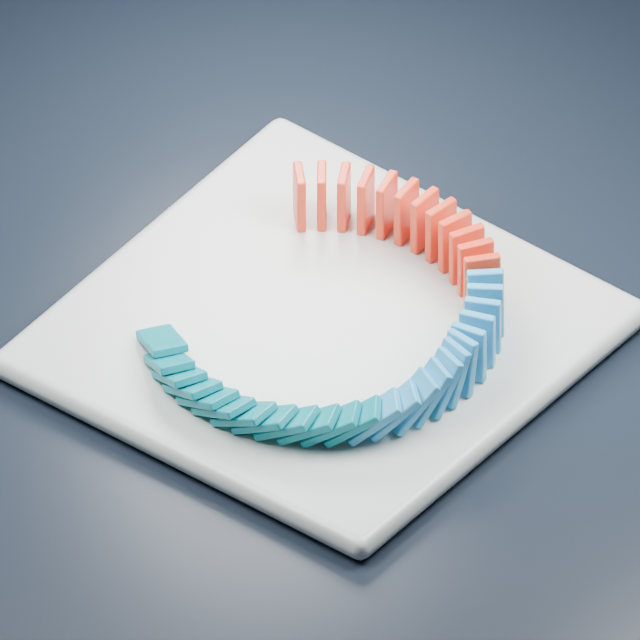

# Chain Reaction — Blender animation study

A five-second domino cascade, built and simulated in Blender, with a soft studio look and editable source.

[Watch or download the portrait video (720 × 1280)](domino-portrait.mp4) · [Landscape video (1280 × 720)](domino-landscape.mp4)

[Get the editable Blender kit — $1](https://donghao-works.itch.io/chain-reaction-blender-kit). Includes both scenes, both videos and a commercial-use license.

## What is in the scene

36 beveled dominoes, three coordinated materials, a raised platform and a three-light studio setup. The rigid-body simulation drives the cascade; sampled transforms are baked into animation keys so the saved scene plays without a separate simulation cache.

Both versions run for five seconds at 24 fps. They are rendered directly in Cycles, with room around the subject for campaign copy. This is an original self-directed animation study.

## A small starting project

For $5, I can set up one simple five-second rigid-body animation test with supplied props, one camera and one revision. Send the reference and the Blender file through [my itch.io profile](https://donghao-works.itch.io/) so we can choose the movement and look.

