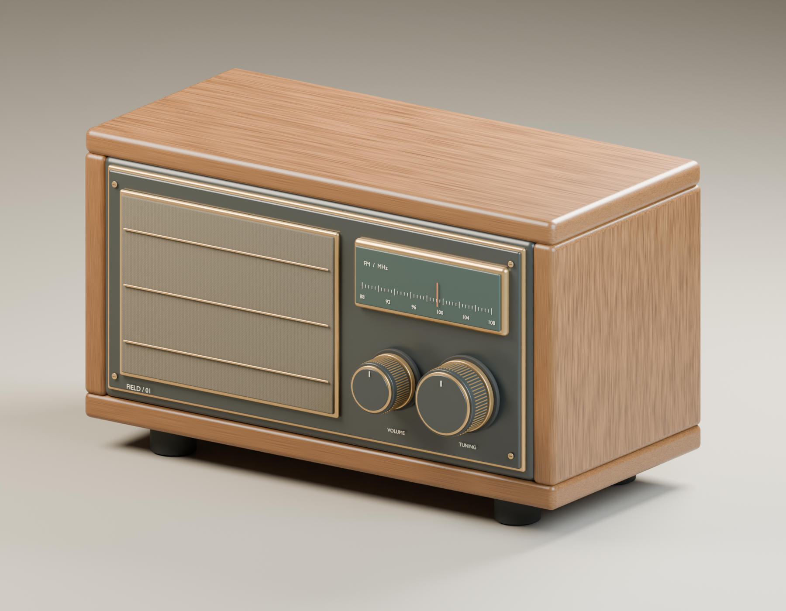
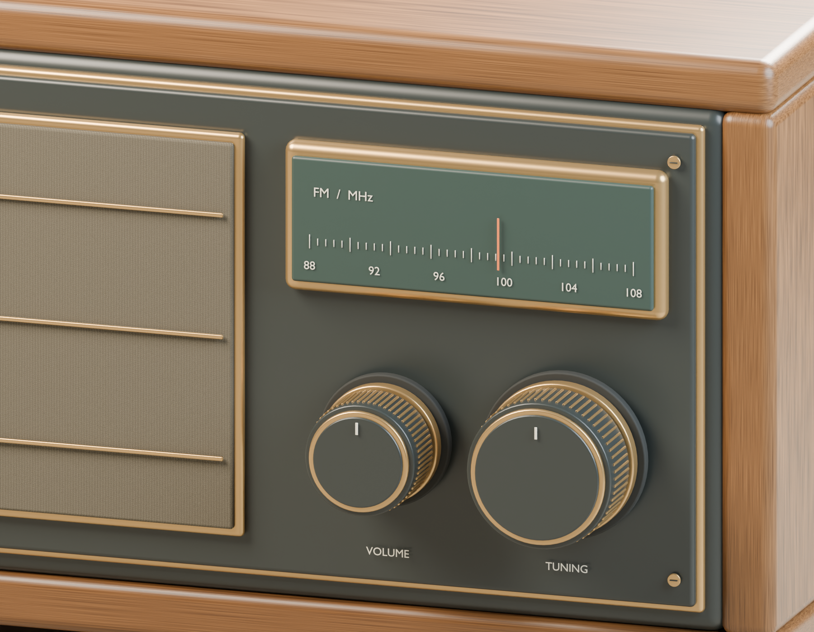
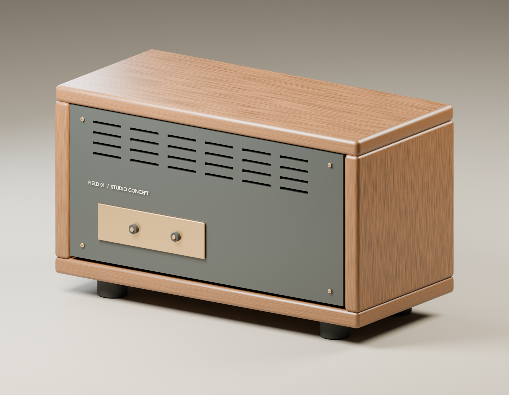

# FIELD / 01 — product modeling and studio lighting

An original tabletop radio concept in wood, graphite and brass. Built as an editable Blender scene, with separate cabinet panels, controls, dial markings and studio lighting.

## Details you can direct

The cabinet proportions, finish, knob shape, dial layout and camera framing can be changed individually. The close-up shows the woven speaker surface, fine grip details, printed scale and fasteners.

## A complete view of the object

The back includes a removable panel design, ventilation details, connector shapes and screw heads. This is a self-directed visual concept.

## A small first project

Have a product model that needs a better presentation? Send the model and a reference for the look you want.

**US$5 trial:** one studio view from a supplied render-ready Blender model, an 1800px PNG and one revision to lighting or framing. I will check the file and agree the view with you first. Modeling or larger changes can be scoped separately.

[Send a brief to Donghao](mailto:alidonghao118@gmail.com?subject=Product%20render%20trial)

The images above are rendered from the same Blender scene. Wood and cloth use procedural Blender materials; the editable source keeps the components and lighting separate.

[More work samples](README.md)
