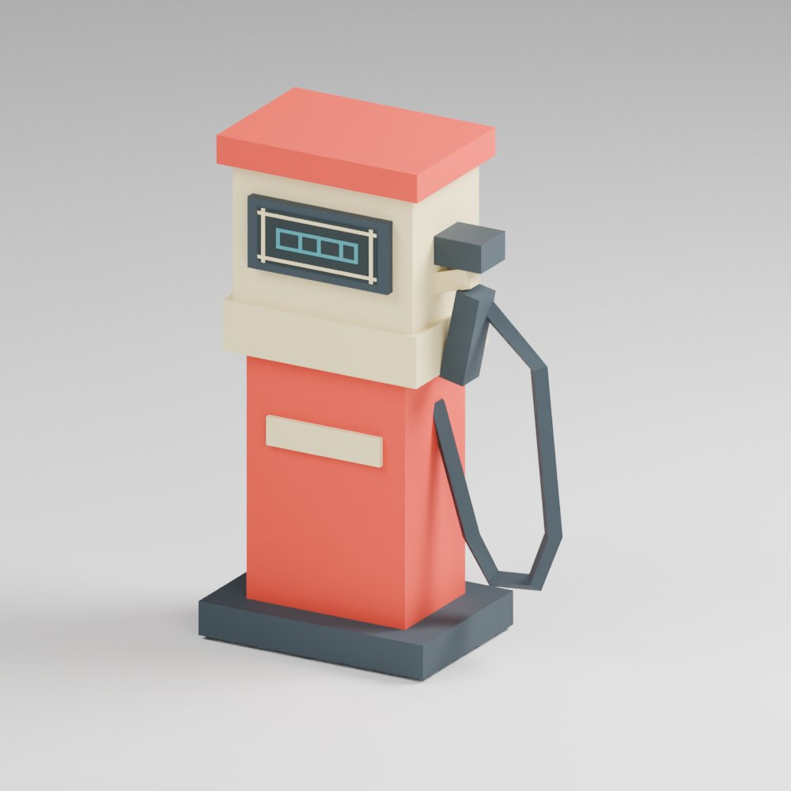

# Retro fuel pump — compact prop sample

An original static prop built in Blender: **174 triangles, one material, one 32 × 32 PNG atlas**. The gauge uses the same atlas as the body and hose. Flat surfaces and nearest-neighbour texture sampling keep the silhouette and pixel display readable.

[Download the model and source](retro-fuel-pump-sample.zip)

The ZIP includes a Blender 5.2 scene, GLB, triangulated OBJ/MTL, PNG atlas and verification notes. GLB and OBJ were imported into clean Blender scenes; both retained 174 triangles and loaded the texture. The studio floor, lights and camera are preview elements in the .blend; the GLB/OBJ contain only the prop.

This sample demonstrates a compact mesh and texture workflow. Target-console exporter, texture format, palette restrictions and in-engine behaviour are checked against each project's pipeline before a production asset is accepted.

## Small paid trial

**$5 for one simple static prop**, with the triangle budget, texture size and export format agreed first. Includes editable source, exported model and one small revision. Two days after the brief and funded milestone are confirmed. General rate: $5/hour for separately agreed follow-on work.

Sample model and texture © Donghao Li, 2026. You may inspect and test these sample files. Redistribution or incorporation into a commercial product requires permission; commissioned work receives its own agreed usage rights.
